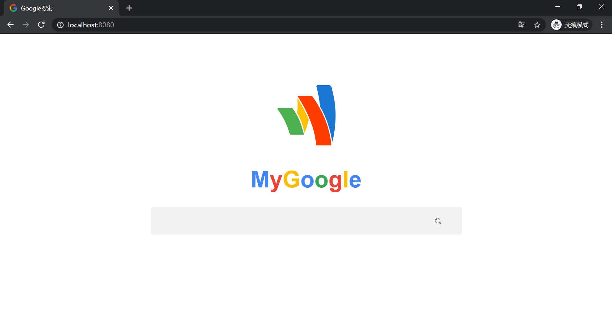
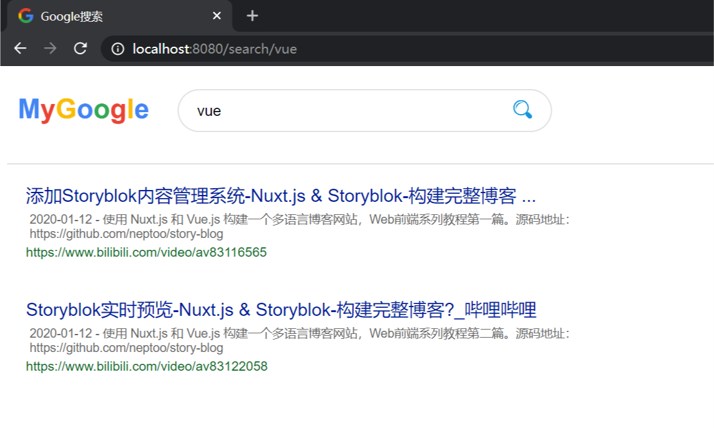
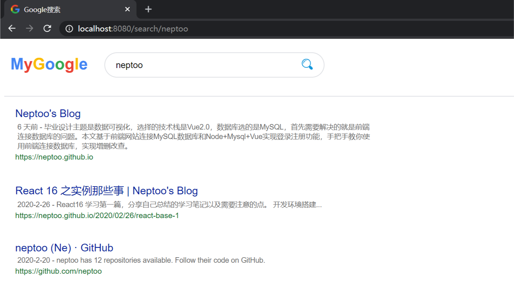

# Front-End of browser enginee

## Project Brief

**It's built with following tech stack**

- Vue-Cli 3.x
- Less
- Vue Router

## Preview

### setup

```
npm install
```

### compiles and hot-reloads for development
```
npm run serve
```

Then it will run at http://localhost:8080/ .





